# skills-public

This repo is two things:

1. **A public catalog of generalized skills** (in [`skills/`](skills/)). These are
   de-identified versions of skills I actually build and run day to day in Claude Code
   and Notion. Each one is automatically rewritten from my private repo into a generic,
   setup-ready playbook: proprietary names, IDs, and internal tooling are stripped and
   replaced with placeholders and plain-language descriptions of the capability, so you
   can stand the skill up in your own environment. Nothing lands here without a human
   review pass. The same catalog is browsable as a Notion site:
   **[AI Skills (Personal)](https://austenhendler.notion.site/AI-Skills-Personal-3bb98c2112688146bf4dd78712152902)** — every skill is a database
   row whose page body is the playbook itself.
2. **The sync system itself** — keep your
   [Claude Code skills](https://docs.claude.com/en/docs/claude-code/skills) in
   **three-way sync**: a **GitHub repo** ⇄ a **Notion database** ⇄ the **local**
   `~/.claude/skills/` directory Claude Code triggers from.

Skills stay plain markdown files a coding agent can read and edit — and every skill also
lives in Notion as a database row with a real page body, where your team can browse the
catalog, comment, and collaborate.

## How these skills get created

Every skill in [`skills/`](skills/) started life as a private, working skill — not
documentation written after the fact:

1. **Built in real work.** A skill begins as instructions for a task I actually do
   (in Claude Code or Notion AI), then gets exercised repeatedly on real cases.
2. **Hardened as a living document.** Each run that reveals a rule, edge case, or gotcha
   gets appended back into the skill, so the playbook accumulates operational lessons
   instead of staying a first draft.
3. **Synced everywhere I work.** Private skills live in three-way sync — local files
   Claude Code triggers from ⇄ a private GitHub repo ⇄ a Notion database — so an edit
   from any surface propagates to the rest (that's the sync system in this repo).
4. **De-identified automatically.** When a skill reaches Active status, any change to it
   triggers a pipeline that has Claude rewrite it as a generic playbook:
   employer/customer specifics come out, internal tools become plain-language capability
   descriptions, IDs become placeholders, and a first-time setup section is added for
   things the private version assumed.
5. **Reviewed by a human, then published.** The rewrite lands as a pull request here —
   nothing merges without review — and on merge the skill syncs onward into the public
   Notion catalog automatically.

## Architecture: the full five-location pipeline

The complete system spans five locations. A private Notion database is the **source of
truth**; a private GitHub repo is the **transport hub**; this repo and the public Notion
catalog are the de-identified, review-gated public ends.

```mermaid
flowchart LR
    subgraph localBox ["1. Local machine"]
        codingAgent["Coding agent sessions"]
        localSkills["~/.claude/skills (symlink)"]
    end
    subgraph privateHub ["2. Private repo (hub)"]
        privRepo[("private skills repo")]
        privAction[["sync-to-notion Action"]]
        privWorker["Private sync worker"]
    end
    subgraph workNotion ["3. Private Notion (source of truth)"]
        workDb[("AI Skills DB")]
        webhookAuto{{"Send webhook automation"}}
        publisher["Publishing agent"]
        staging["Staging pages"]
    end
    subgraph publicSide ["4. This repo (public)"]
        review[/"Maintainer review"\]
        pubRepo[("skills-public")]
        pubAction[["sync-to-notion Action"]]
        pubWorker["Public sync worker"]
    end
    subgraph personalSide ["5. Public Notion catalog"]
        personalDb[("AI Skills Personal DB")]
        site["Published Notion site"]
    end

    codingAgent -->|"Edits skills"| localSkills
    localSkills <-->|"git push / pull"| privRepo
    privRepo -->|"SKILL.md push"| privAction
    privAction -->|"Runs pushToNotion"| privWorker
    privWorker -->|"Writes row + body"| workDb
    workDb -->|"UI edit"| webhookAuto
    webhookAuto -.->|"skillRowChanged"| privWorker
    privWorker -->|"Commits skills-sync"| privRepo
    workDb -.->|"Active skill changed"| publisher
    publisher -->|"De-identifies"| staging
    staging -->|"Human reviews"| review
    review -->|"Merge"| pubRepo
    pubRepo -->|"Push to main"| pubAction
    pubAction -->|"Runs pushToNotion"| pubWorker
    pubWorker -->|"Writes row + body"| personalDb
    personalDb -->|"Published as"| site

    style localBox fill:#EDEDED,stroke:#B3B3B3
    style privateHub fill:#C2E5FF,stroke:#3DADFF
    style workNotion fill:#DCCCFF,stroke:#874FFF
    style publicSide fill:#CDF4D3,stroke:#66D575
    style personalSide fill:#C6FAF6,stroke:#5AD8CC
    style workDb fill:#FFECBD,stroke:#FFC943
    style review fill:#FFE0C2,stroke:#FF9E42
```



How the flows work:

- **Local ⇄ private repo** is ordinary git (the local skills directory is a symlink into
  the repo, so the coding agent and the repo share the same files).
- **Private repo → private Notion DB**: a GitHub Action fires on any `SKILL.md` push and
  runs the sync worker, which updates the database row and writes the page body with
  targeted diffs so block IDs — and comments anchored to them — survive.
- **Private Notion DB → private repo**: editing a row in the Notion UI fires a database
  automation ("Send webhook") that calls the worker, which recomposes `SKILL.md` and
  commits it back with a sync marker the Action knows to skip (loop prevention).
- **Publishing gate**: when an **Active** skill changes, a Notion agent rewrites it as a
  generic playbook into staging pages. Skills on a private deny-list (personal,
  non-work-playbook skills) never publish, and nothing merges into this repo without
  human review.
- **This repo → public Notion catalog**: merges to main fire this repo's own Action and
  worker, which sync each skill into the public database behind the published Notion
  site. Status fields intentionally don't sync outward — the private DB owns status, the
  public copies are mirrors.

The two ends of the pipeline are the parts you can reuse directly: the three-way sync
core (local ⇄ GitHub ⇄ Notion) is documented below.

```
  Local (~/.claude/skills, a git clone)
        ⇅  git pull / push
  GitHub repo (skills/<slug>/SKILL.md)   ← hub
        ⇅  Notion worker (worker/)
  Notion "AI Skills" DB (row + body page)
```

GitHub is the hub. `local ⇄ GitHub` is ordinary git. `GitHub ⇄ Notion` is bridged by the
[`ntn`](https://developers.notion.com) worker in [`worker/`](worker/). `local ⇄ Notion`
happens transitively through GitHub.

## Layout

| Path | What |
|------|------|
| `skills/<slug>/SKILL.md` | one skill = frontmatter (Notion row props) + markdown body (the Notion page) |
| `.sync/<slug>.md` | last-synced canonical body per skill — used to diff for comment-preserving writes and to detect echoes/conflicts. **Excluded from the Action trigger.** |
| `worker/` | the `ntn` worker that syncs GitHub ⇄ Notion (both directions) |
| `.github/workflows/sync-to-notion.yml` | on push to `skills/**/SKILL.md`, invokes the worker (GitHub → Notion) |

## The SKILL.md contract

```yaml
---
name: my-skill                   # slug = Claude Code skill name = folder name
skill: My Skill                  # Notion title (Skill property)
description: ...                 # what Claude Code triggers on
status: Active                   # ↔ Status   (Idea|Backlog|Drafting|Testing|In review|Active|Retired)
category: [Research, Analysis]   # ↔ Category (multi-select)
proficiency: Expert              # ↔ Proficiency
trigger: Agent                   # ↔ Trigger
last_tested: 2026-05-19          # ↔ Last tested
notes: ...                       # ↔ Notes
notion_row: https://notion.so/<row-id>   # mapping (DB row) — written back by the worker
notion_doc: https://notion.so/<doc-id>   # mapping (body page) — written back by the worker
---
<full skill instructions as markdown>
```

A new `SKILL.md` with no `notion_row`/`notion_doc` → the worker **creates** the Notion row +
body page and writes the IDs back into frontmatter. See
[`skills/example-skill/SKILL.md`](skills/example-skill/SKILL.md).

## Sync directions

**GitHub → Notion.** The GitHub Action fires on push → invokes the worker's `pushToNotion` →
it parses the changed `SKILL.md` → updates the Notion row props + writes the body back via
`PATCH /v1/pages/{id}/markdown` using **`update_content`** (targeted `{old_str,new_str}`
diffs, never a wholesale replace) so block IDs — and the comments anchored to them — survive.

**Notion → GitHub.** Run the worker's `pushToGitHub` with the changed page id → it reads the
row props + body via `GET /v1/pages/{id}/markdown` → composes `SKILL.md` → commits to the
repo. Repo files are matched by their `notion_row` link (never by title), so renaming a row
can't fork a skill.

To make this automatic, the worker exposes a `skillRowChanged` **webhook** capability.
Wire it up once:

1. Set a shared secret on the worker: `ntn workers env set WEBHOOK_SECRET=<random hex>`.
2. Get the endpoint: `ntn workers webhooks list` (the URL embeds its own secret id —
   treat it like a credential, don't commit it).
3. On your AI Skills database, add a database automation: **When** "Page edited" (and/or
   "Page added") → **Do** "Send webhook" → paste the URL, and add a custom header
   `X-Skills-Sync-Secret: <the same secret>`.

The handler verifies the header, pulls the page id out of the automation's payload
(`data.id`), and runs the same echo-skip/conflict-flag sync as a manual `pushToGitHub`.
Manual invoke still works: `POST {"pageId": "<row-id>"}` with the header, or
`ntn workers exec pushToGitHub -d '{"pageId":"<row-id>"}'`. (A `worker.automation()`
capability would be the native trigger, but it's currently a private alpha.)

**Repair.** `forcePushToNotion` replaces a page body wholesale from GitHub and refreshes the
snapshot — for migrating or fixing a desynced skill (comment anchors on that page are lost).

## Comment preservation

Notion comments are anchored to block IDs and are **not** part of the markdown.

- **Edits that keep a block** → comments survive (block ID is stable under `update_content`).
- **Deletions that remove a block** → the comment's anchor is gone. The worker's
  `COMMENT_DELETE_POLICY` controls what happens:
  - `flag` (default): don't delete; raise a Notion comment + GitHub issue for a human to resolve.
  - `salvage`: re-post the comment text/author as a page-level comment, then delete.
  - `allow`: delete anyway.

## Loop prevention & conflicts

1. Per-skill last-synced snapshot in `.sync/` stores the **round-tripped** markdown (Notion
   normalizes formatting on write, so the snapshot must be what a fresh GET returns).
2. The worker's GitHub commits carry a `[skills-sync]` marker and a bot author; the Action
   skips them.
3. If **both** sides changed a skill since the last sync, the worker does **not** overwrite —
   it flags (Notion comment + GitHub issue). Resolution is manual.

Two gotchas learned in production:

- Notion **normalizes markdown** on import (blank lines, code-fence indentation) without
  losing content. The snapshot design absorbs this.
- Notion **auto-links bare `FILE.md` tokens** into `http://FILE.md` links. Wrap file
  references in backticks in skill bodies.

## Setup

1. **Notion**: create a database with properties matching the frontmatter contract above
   (Skill title, Status status, Category multi-select, Proficiency select, Trigger select,
   Last tested date, Notes text, "What it does" text, "Doc URL" url). Create an internal
   integration with read+update content, share it into the DB and the parent page where
   body pages should live.
2. **Worker**: `cd worker && npm install && npm run build`, then
   `ntn login && ntn workers deploy` (creates `workers.json`). Set its env:
   `SKILLS_NOTION_TOKEN`, `GITHUB_TOKEN` (fine-grained PAT for this repo: Contents R/W,
   Metadata R, Issues R/W), `AI_SKILLS_DATASOURCE`, `GITHUB_REPO`, `SKILL_BODY_PARENT`
   (page id under which new body pages are created). Note: the deployed platform reserves
   the `NOTION_` env prefix — hence `SKILLS_NOTION_TOKEN`.
3. **GitHub Action**: add repo secret `NOTION_API_TOKEN` (mint with `ntn tokens create`).
   Commit your `workers.json` (or set the path in the workflow) so CI can resolve the
   worker id.
4. **Local**: clone this repo and symlink `~/.claude/skills` at the `skills/` directory —
   local and repo are then the same files.

**Local dry run** (read-only; needs only a Notion token in `worker/.env`):

```sh
cd worker && cp .env.example .env
npx tsx src/cli.ts dry <row-or-body-page-id>   # prints composed SKILL.md, no writes
npx tsx src/selftest.ts                        # token-free: diff engine + frontmatter checks
```

## Worker tool docs

Rows in the AI Skills database with `Type = Worker` publish here too, at `skills/worker-<name>/SKILL.md`.

Why: a deployed Notion Worker is only useful to an outside agent if that agent knows the tool names, the inputs, and how to call them. The Worker row page holds that documentation, so the row page is its own body source. There is no separate body page, and the `Doc URL` property points at the Worker instead of at a Notion page.

Frontmatter adds two keys for these rows:

- `type` is `Worker`
- `worker_url` comes from the `Location` property

Rows with `Type = Agent` or `Type = Workflow` still stay in Notion.

### Tools, not syncs

Only a Worker's **tools** publish. Sync capabilities, webhooks, and schedules are internal
plumbing that an outside agent cannot call, so leave them out of the row page body. Write one
section per tool: name, purpose, input fields with types, and the shape of the return value.

## Publish guard (agent-browser docs)

`worker/src/publish.ts` blocks any composed `SKILL.md` that explicitly documents agent-browser
usage from reaching a **public** repo. Signals include "agent browser", browser session or
cookie control, headless Chrome, Playwright, Puppeteer, Selenium, WebDriver, browser tool names
such as `terminalWithBrowser`, and web scraping. The order of decisions is:

1. `PUBLISH_BROWSER_DOCS=1` in the worker env allows everything. Use it when every target repo
   is private.
2. A line `publish: public` anywhere on the row page allows that one row.
3. A private target repo allows everything, because nothing becomes public.
4. Otherwise the sync returns `noop` with the reason. If the file is already in the repo, the
   worker also comments on the row. It never deletes a published file for you.

Run `ntn workers exec checkPublish -d '{"pageId":"<row url>"}'` to see the verdict for a row
without writing anything.
